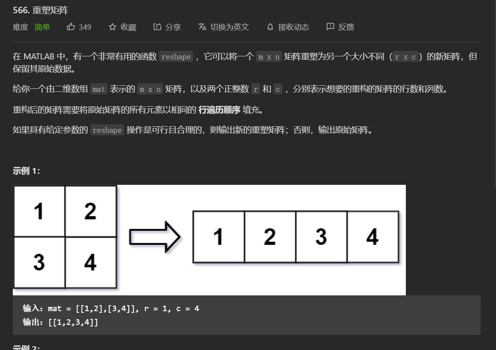

# 566. 重塑矩阵



## 暴力思路

对给定的二维动态数组进行遍历，将元素依序插入到新数组中。插入时逐行插入，先将元素插入到一维数组，当一维数组长度达到c时将整行插入到二维数组中。

最后加入判断，当插入后行数不符合要求是，输出原数组。

代码如下：

``` cpp
class Solution {
public:
    vector<vector<int>> matrixReshape(vector<vector<int>>& mat, int r, int c) {
        vector<vector<int>> result;
        vector<int> temp;
        int t = 0;
        for (int i = 0; i < mat.size(); i++)
        {
            for (int j = 0; j < mat[0].size(); j++)
            {
                temp.push_back(mat[i][j]);
                t++;
                if(t == c)
                {
                    result.push_back(temp);
                    temp.resize(0);
                    t = 0;
                }
            }
        }
        if(result.size() != r)
            return mat;
        return result;
    }
};
```

## 算法性能

- 57/57 cases passed (4 ms)
- Your runtime beats 98.74 % of cpp submissions
- Your memory usage beats 8.42 % of cpp submissions (10.9 MB)